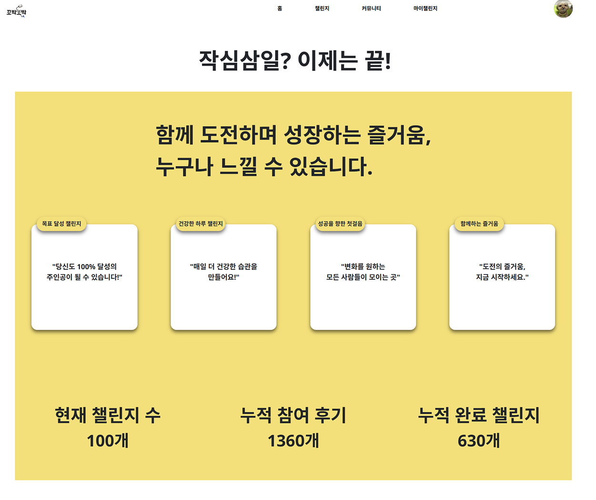

## 꼬박꼬박

## 📖 프로젝트 개요

**1. 소개**  
  - 개   요 : 건강한 습관 형성을 위한 플랫폼 개발  
  - 작업기간: 2024/10/23 ~ 2024/12/03  
  - 팀원구성: 총 5명  

**2. 목표**  
  - 효율적인 시간 관리 및 습관 형성을 위한 플랫폼 구축  
  - 독서, 미라클 모닝, 운동 등 다양한 도전 목표 제공  
  - 도전 기록을 기반으로 사용자 간 상호 동기부여  

**3. 주요 기능**  
  - 챌린지 참여 및 기록  
    - 개인이 직접 목표 설정 후 진행 상황을 기록  
  - 커뮤니티 연동  
    - 도전 기록을 공유하며 서로 응원하고 동기부여  

## ⚙️ 개발환경 및 기술 스택  

  - **개발 환경**  
    - OS: Windows 11  
    - Database: Oracle  

  - **사용 기술**  
    - **프론트엔드**
      
      
      
      
     
    - **백엔드**
      
      
      
      
      
 
    - **개발환경**
      

## 😊 담당 기능

**1. 메인**  
  -   
  - `HttpSession`을 활용하여 **로그인 상태 유지**  
  - 챌린지 목록 조회 (DAO를 활용하여 데이터 조회)  
  - 사용자의 점수를 기반으로 **등급 설정**  

**2. 헤더**  
  -   
  - jQuery를 활용한 **프로필 정보 노출/숨김 기능**  
  - JSTL을 이용하여 **등록된 프로필 사진 표시**  

**3. CRUD 기반 커뮤니티**  
  -   

  - **검색 기능**  
    - Java와 SQL을 활용하여 **제목, 닉네임, 내용 기반의 다중 조건 검색 기능** 구현  
    - `LIKE 연산자`를 활용하여 필터링 처리  
  
  - **페이징 기능**  
    - `PagingUtil` 클래스를 활용하여 **게시글을 페이지 단위로 표시**  
    - 총 게시글 개수를 기반으로 동적 페이지네이션 구현  
  
  - **게시글 CRUD 기능**  
    - `session` 값을 활용하여 **작성자와 일치할 경우에만 수정/삭제 버튼 활성화**  
  
  - **댓글 기능**  
    - Java & SQL을 활용한 **댓글 등록, 수정, 삭제 및 페이징 처리**  
    - JavaScript & Ajax를 활용하여 **비동기 처리(페이지 새로고침 없이 반영)**  
    - `session` 값을 활용하여 **댓글 작성자에게만 수정/삭제 버튼 노출**  
  
  - **좋아요 기능**  
    - Java & SQL을 활용하여 **좋아요 상태 및 개수 관리**  
    - JavaScript & Ajax를 활용하여 **실시간 업데이트 구현**  

## 💡 문제 해결 및 경험한 점  

### **[NULL 값으로 인한 SQL 오류 방지]**  

✔ **문제점**  
  - `sub_sql` 값이 `NULL`일 경우, SQL 실행 시 오류 발생  

✔ **해결 과정**  
  - `sub_sql`을 **빈 문자열("")로 초기화**하여 안전한 SQL 조합  
  - NULL 값이 발생해도 예외 없이 실행될 수 있도록 예외 처리 추가  

✔ **결과**  
  - SQL 실행 오류 방지 및 유지보수성 향상  

## ❓ 프로젝트를 통해 배운 점  

💡 **매일매일 프로젝트 진행 상황을 기록하며 성장**  
  - 프로젝트 진행 중 **매일 작성한 상세 일지**를 통해 개발 과정을 돌아볼 수 있었음  
  - 완료 후에도 **기록을 통해 문제 해결 과정 및 배운 점을 복습**할 수 있었음  

💡 **원활한 소통이 프로젝트 성패를 결정한다는 점을 깨달음**  
  - 다양한 의견을 조율하며 **중간 역할을 수행**  
  - 팀원 간 의견 충돌 시, **설득력 있는 근거를 제시하며 원활한 협업을 이끌어냄**  

💡 **DB 설계 과정에서의 도전과 성장**  
  - 데이터의 구조를 효율적으로 설계하는 것이 중요함을 체감  
  - 더 나은 데이터 모델링을 고민하며 **추가적인 학습이 필요하다는 점을 인식**  

💡 **요구사항 정의서 작성 경험**  
  - UX를 고려한 화면 흐름 설계를 통해 **사용자 중심의 기능 구현이 가능**  
  - 체계적인 요구사항 정리로 **개발 효율성 극대화**
